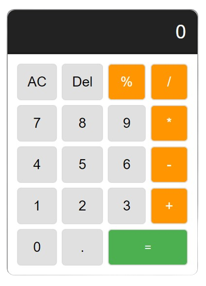

# Calculator
================

A simple calculator application built with HTML, CSS, and JavaScript.

## Features
---------

* Basic arithmetic operations: addition, subtraction, multiplication, and division
* Simple and intuitive interface
* Error handling for invalid input

## How to Use
---------

1. Open the calculator by clicking on the HTML file.
2. Enter a number by clicking on the number buttons.
3. Select an operator by clicking on the operator buttons.
4. Enter another number by clicking on the number buttons.
5. Click the "=" button to calculate the result.

## Technical Details
---------

* Programming Language: JavaScript
* Framework: None
* Dependencies: None

## Contributing
---------

If you'd like to contribute to the Calculator project, please fork this repository and submit a pull request.

## License

This project is licensed under the MIT License. See the `LICENSE.txt` file for details.

## Acknowledgments

* [Code Crafter] for creating this calculator project

## Changelog
---------

### v1.0

* Initial release

### v1.1

* Added error handling for invalid input

## Screenshots

## Known Issues

* None

## Future Development
---------

* Add support for more advanced mathematical operations
* Improve the user interface and user experience
* Add support for multiple themes and customization options

I hope this helps! Let me know if you need any further assistance.

## Contact
---------

If you have any questions or feedback, please don't hesitate to contact me at 
<h3 align="left">Connect with me:</h3>

    
    
    
    

